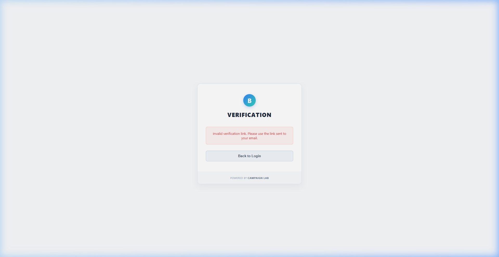
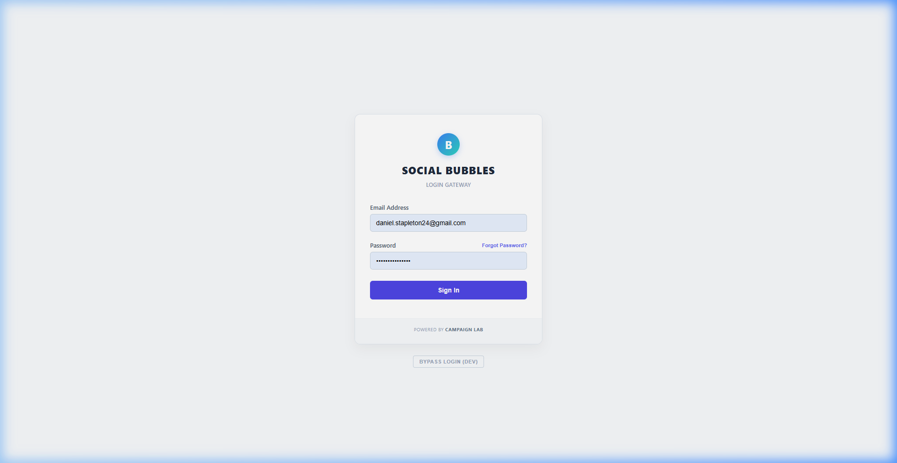
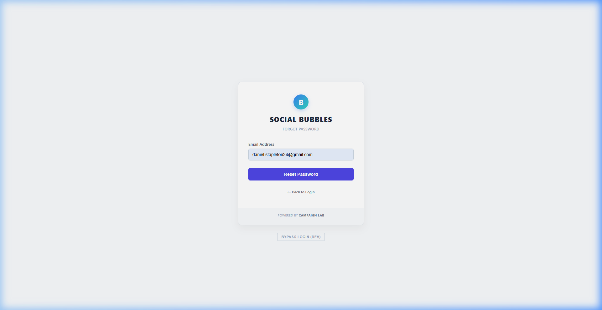
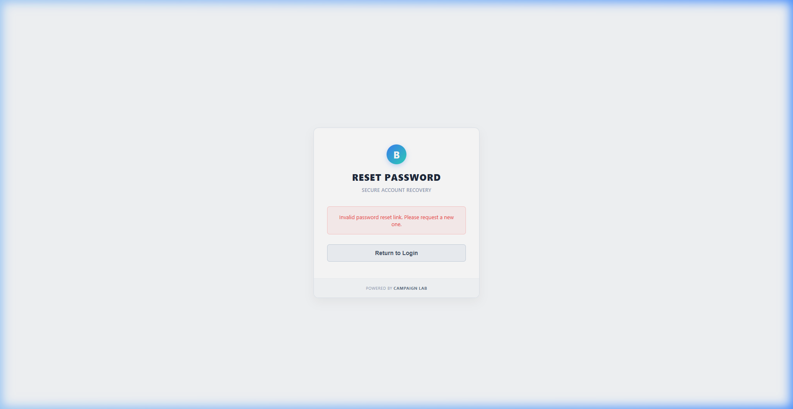

# Authentication & Access Control

The Bubbles Gateway uses two distinct authentication methods to balance security in production with rapid iteration in development.

## 1. Production Authentication (Supabase)
In production, the application is secured by Supabase. Access is strictly controlled via an **Invite-Only** or **Manual Signup** system.

### The Invitation Flow
1. **Invite Sent**: An administrator invites a user via the Supabase Dashboard.
2. **Email Received**: The user receives a branded "Welcome to the Squad" email.
3. **Acceptance**: Clicking the link opens the Bubbles Gateway. 

4. **Setup**: The user is prompted to set a secure password for their new account.
5. **Entry**: Once the password is set, the user is automatically verified and granted access to the Dashboard.

### Password Recovery
If a user forgets their password:
1. Navigate to the Login screen.

2. Click **"Forgot Password?"** (located right above the Sign In button).

3. Enter the registered email address.
4. **Silent Confirmation**: The system will confirm that a link has been sent (regardless of whether the email exists) to protect against email enumeration.
5. **Reset**: Follow the link in the email to set a new password.

### Strict Verification Enforcement
- **Unverified Sessions**: The system will automatically log out and clear sessions for users who have not confirmed their email address.
- **Account Deletion**: If an administrator deletes a user account, the application will forcefully eject the user back to the login wall on the next page refresh (using secure `getUser()` verification).

## 2. Developer Access (Bypass Mode)
For local development and UI testing, you can bypass the login wall entirely. 

- **Control**: Toggle via the `VITE_ALLOW_BYPASS` environment variable.
- **Usage**: Click the **"BYPASS LOGIN (DEV)"** button on the starting screen to enter as a mock Administrator.

---

## 🛠 Project Management
Administrators can manage users directly in the [Supabase Dashboard](https://supabase.com/dashboard).

- **Rate Limits**: Password resets are rate-limited to prevent spam.
- **Email Templates**: Branded HTML templates for Invites and Resets are configured in the Supabase "Email Templates" settings.

### Email Templates (Previews)

*Placeholder for real email client screenshots*

- **Invite Email**: Sent when a user is invited to the squad.
- **Reset Password Email**: Sent when a user requests a password recovery.
- **Verification Email**: Sent for new signups.
